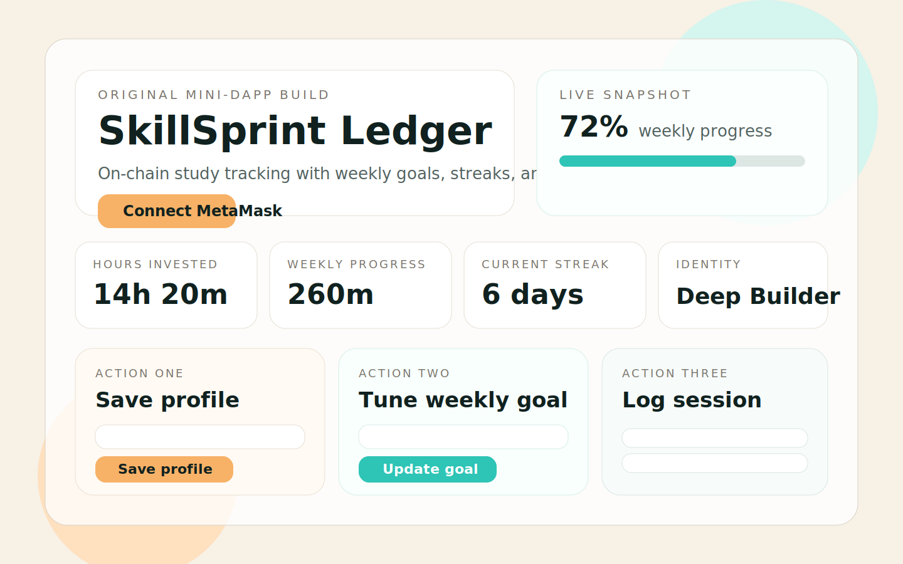
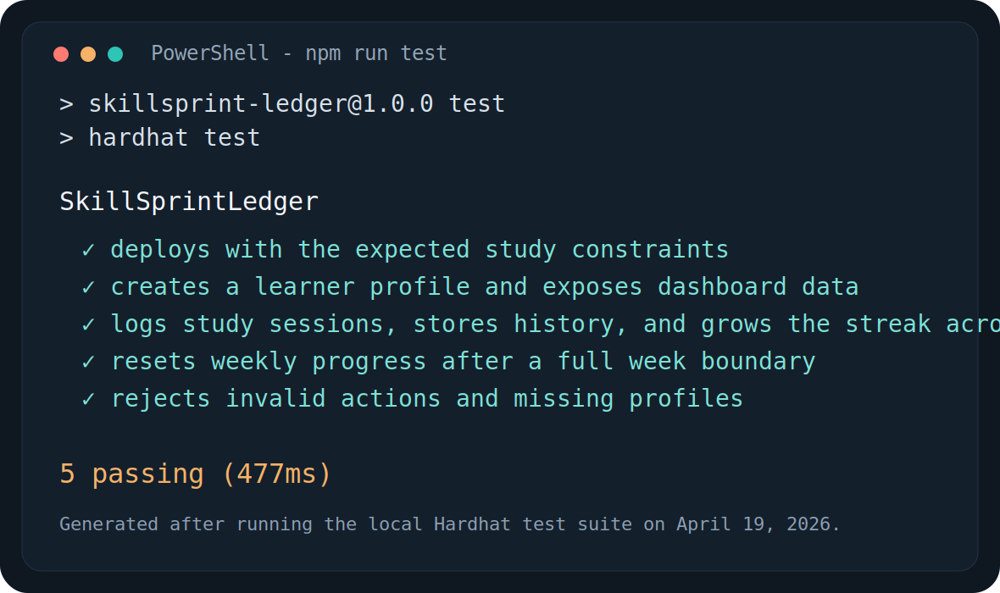

# SkillSprint Ledger

SkillSprint Ledger is a fully original end-to-end mini-dApp for tracking focused study time on-chain. Users connect a wallet, create a public learner profile, set a weekly study target, and log individual learning sessions that build a streak and recent-session history.

## Live Demo

- Vercel link: `Add your deployed URL here`
- Suggested production setup: deploy the repo root on Vercel with `npm install` and `npm run build`

## Demo Video

- Demo video link: `Add your 1-minute Loom or YouTube link here`
- Recommended recording flow is included in the `Demo Script` section below

## Preview

### UI concept



### Test output



## Features

- Wallet connection with MetaMask
- On-chain learner profile creation with display name and weekly study goal
- Weekly goal updates without redeploying the contract
- Study session logging with topic, minutes spent, and streak tracking
- Rolling daily streak logic
- Weekly progress reset logic inside the smart contract
- React Query caching for dashboard and recent sessions
- Loading states, skeleton placeholders, and transaction feedback
- Hardhat tests covering deployment, functionality, and edge cases
- Vercel-ready frontend build pipeline

## Tech Stack

- Frontend: React + Vite
- Smart contracts: Solidity + Hardhat
- Web3: ethers.js
- Client-side caching: TanStack Query
- Testing: Hardhat + Mocha + Chai
- CI: GitHub Actions

## Project Structure

```text
frontend/
contracts/
test/
scripts/
assets/
README.md
.env.example
package.json
hardhat.config.js
vercel.json
```

## How It Works

### Core user actions

1. Create or refresh a learner profile
2. Update the weekly study goal
3. Log a study sprint with topic and minutes

### Contract behavior

`SkillSprintLedger.sol` stores:

- `LearnerProfile` structs keyed by wallet address
- Per-user `StudySession[]` history
- Weekly progress counters
- Consecutive-day streak information

### Main contract functions

- `saveProfile(string displayName, uint32 weeklyGoalMinutes)`
- `updateWeeklyGoal(uint32 newGoalMinutes)`
- `logSession(string topic, uint32 minutesSpent)`
- `getDashboard(address learner)`
- `getSessionCount(address learner)`
- `getSession(address learner, uint256 index)`
- `hasProfile(address learner)`

### Events

- `ProfileSaved`
- `WeeklyGoalUpdated`
- `StudySessionLogged`

### Validations

- Display name must be between 3 and 32 characters
- Topic must be between 3 and 48 characters
- Session duration must be between 5 and 480 minutes
- Weekly goal must be between 30 and 5000 minutes

## Local Setup

### 1. Install dependencies

```bash
npm install
```

### 2. Start a local chain

```bash
npx hardhat node
```

### 3. Deploy the contract

In a second terminal:

```bash
npm run deploy:local
npm run export:abi
```

### 4. Start the frontend

```bash
npm run dev
```

### 5. Production build check

```bash
npm run build
```

## Environment Variables

Create the following files if you want to override defaults:

- Root `.env` for Hardhat deployment credentials
- `frontend/.env` for frontend RPC and contract settings

### Root `.env.example`

```bash
SEPOLIA_RPC_URL=https://ethereum-sepolia-rpc.publicnode.com
PRIVATE_KEY=0xyour_private_key
ETHERSCAN_API_KEY=your_etherscan_api_key
VITE_RPC_URL=http://127.0.0.1:8545
VITE_CHAIN_ID=31337
VITE_CONTRACT_ADDRESS=
```

### Frontend `.env.example`

```bash
VITE_RPC_URL=http://127.0.0.1:8545
VITE_CHAIN_ID=31337
VITE_CONTRACT_ADDRESS=
```

## Testing

Run the contract tests with:

```bash
npm run test
```

Current local result:

- 5 passing tests

Coverage of those tests:

- Deployment and configured study limits
- Profile creation and dashboard reads
- Session logging and session history
- Streak growth across days
- Weekly reset logic
- Validation failures and missing-profile edge cases

## Deployment Notes

### Local deployment

- Start Hardhat with `npx hardhat node`
- Run `npm run deploy:local`
- Run `npm run export:abi`

### Sepolia deployment

1. Fill in `SEPOLIA_RPC_URL` and `PRIVATE_KEY` in `.env`
2. Deploy with:

```bash
npx hardhat run scripts/deploy.js --network sepolia
npm run export:abi
```

3. Set frontend values in `frontend/.env`:

```bash
VITE_RPC_URL=https://ethereum-sepolia-rpc.publicnode.com
VITE_CHAIN_ID=11155111
VITE_CONTRACT_ADDRESS=your_deployed_contract_address
```

### Vercel deployment

- Connect the repository in Vercel
- Use the repo root as the project root
- Install command: `npm install`
- Build command: `npm run build`
- Output directory: `frontend/dist`
- Add the same `VITE_*` variables in the Vercel dashboard before deploying a live frontend

## Demo Script

Use this outline for a 1-minute walkthrough:

1. Intro, 0:00-0:10
   - “This is SkillSprint Ledger, an on-chain study tracker built with React, Solidity, Hardhat, and ethers.”
2. Wallet connection, 0:10-0:20
   - Connect MetaMask and point out the detected wallet and chain.
3. Profile setup, 0:20-0:32
   - Create a learner profile with a display name and weekly goal.
4. Core feature, 0:32-0:50
   - Log a study session, show the pending transaction state, and wait for confirmation.
5. Result, 0:50-1:00
   - Highlight the updated weekly progress, streak, and recent-session feed.

## Quality Checklist

- Mini-dApp fully functional for local and testnet flows
- 3+ passing tests included
- README covers setup, deployment, and demo expectations
- Demo link placeholder included
- Live demo placeholder included
- Vercel build configuration included

## Git Notes

Requested git author for commits:

- Username: `balluPiku`
- Email: `priyankabalmiki2007@gmail.com`

## Next Submission Steps

- Deploy the contract to Sepolia or another EVM testnet
- Add the deployed contract address to `frontend/.env`
- Deploy the frontend and replace the live demo placeholder
- Record the 1-minute walkthrough and replace the demo video placeholder
