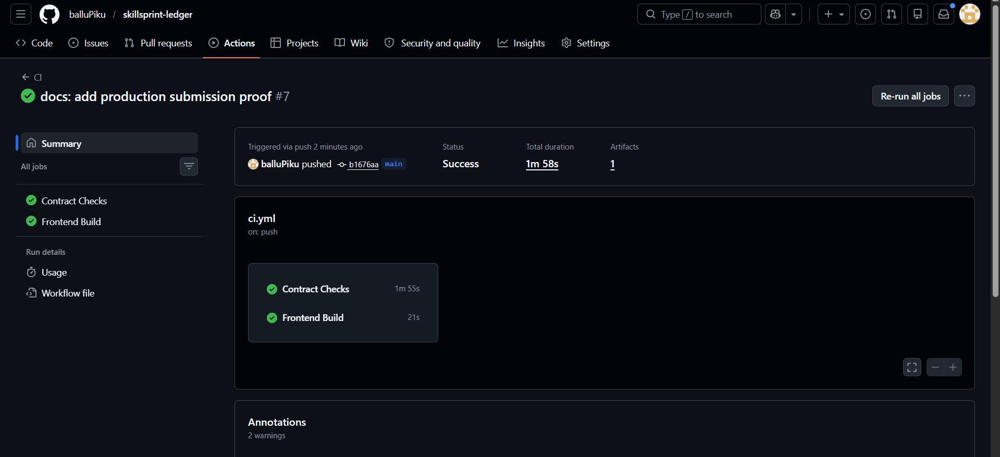

# ⚡ SkillSprint Ledger

<div align="center">

**A Decentralized Focused Learning Tracker on Stellar**

*Audit and gamify study time milestones secured by Stellar Soroban smart contracts and ICC badges*

[](https://skill-sprint-stellar.netlify.app/)
[](https://github.com/npmdeep/skillSprint)
[](https://stellar.expert/explorer/testnet)
[](https://www.risein.com/)

</div>

---

## 📋 Table of Contents

1. [Problem Statement](#-problem-statement)
2. [Why Stellar?](#-why-stellar)
3. [Live Deployment](#-live-deployment)
4. [Contract Addresses & Transactions](#-contract-addresses--transactions)
5. [User Onboarding & Feedback](#-user-onboarding--feedback)
6. [Architecture](#-architecture)
7. [Smart Contracts](#-smart-contracts)
8. [Production Hardening (Level 4)](#-production-hardening-level-4)
9. [Tech Stack](#-tech-stack)
10. [Project Structure](#-project-structure)
11. [Testing](#-testing)
12. [CI/CD Pipeline](#-cicd-pipeline)
13. [Local Development](#-local-development)
14. [Roadmap](#-roadmap)
15. [Author](#-author)

---

## 🔴 Problem Statement

Self-paced study, technical bootcamps, and developer onboarding lack accountable tracking primitives. Learners struggle to prove focus times, verify progress milestones, and share achievements without relying on centralized validation sheets.

| Issue | Impact |
|-------|--------|
| **Unverifiable Progress** | Focus study times and milestones cannot be audited or shared publicly with proof. |
| **Missing Gamification** | Learners lack immediate, on-chain rewards (like badges) for hitting time milestones. |
| **Centralized Control** | Learning achievements are siloed inside specific private learning management platforms. |

**SkillSprint Ledger** removes these constraints. Learners connect a Freighter wallet, configure study milestones, and record focus study sessions directly to the Stellar ledger, earning verified achievement badges.

---

## 🌟 Why Stellar?

SkillSprint Ledger is designed specifically to utilize the native advantages of the Stellar network:

| Stellar Property | SkillSprint Benefit |
|-----------------|-------------------|
| **~5 Second Payouts** | Validates weekly target streaks and issues milestone badges in under 5 seconds. |
| **Micro-fees ($0.00001)** | Makes logging hourly micro-study sessions economically feasible. |
| **Soroban Smart Contracts** | Employs Inter-Contract Communication (ICC) to separate study registries from rewards. |
| **Native Event Stream** | Polls real-time events to power public ledger streams for guest viewers. |

---

## 🌐 Live Deployment

| Resource | Link |
|----------|------|
| 🌍 **Live dApp** | [skill-sprint-stellar.netlify.app](https://skill-sprint-stellar.netlify.app/) |
| 🎬 **Demo Video** | [Google Drive — Walkthrough Recording](https://drive.google.com/file/d/1fyh44vwBPg8KkTM3u7AbpuhR0Jc8XqEj/view?usp=sharing) |
| 💻 **GitHub Repo** | [npmdeep/skillSprint](https://github.com/npmdeep/skillSprint) |
| 📋 **User Feedback Form** | [SkillSprint Ledger Usability Survey — Google Forms](https://forms.gle/7naP6vyZuww1YkJ49) |
| 📊 **Onboarded Users & Wallet Interactions** | [Responses Tracker — Google Sheets](https://docs.google.com/spreadsheets/d/1gVoC5teEIfFM-J1rAwzloLLK95aqXr6hpv0ZY-Pa5Bw/edit?resourcekey=&gid=831543073#gid=831543073) |

---

## 🔗 Contract Addresses & Transactions

All contracts are deployed and cross-initialized on the **Stellar Testnet** using the `npmdeep` developer credentials.

### Deployed Contract IDs

| Contract | Address |
|----------|---------|
| **Ledger Main Contract** | `CBDDGQJN6OJRK445UERC5Y3NUVMRYU4XOUCRKYX6HZ36PV6POO2WJP7G` |
| **Rewards Contract** | `CDIGB24SGW4LAYS74R776KKT7Y2L6WFWY5R6S773H7NOEFLNVE7G3RGM` |

### On-Chain Deployment Transactions

| Action | Transaction Hash |
|--------|-----------------|
| **Rewards Contract — Upload & Deploy** | [`6ba0d83d841ead3c504dbec6f12c0b444d84eea289f191e09ca32db27088e523`](https://stellar.expert/explorer/testnet/tx/6ba0d83d841ead3c504dbec6f12c0b444d84eea289f191e09ca32db27088e523) |
| **Ledger Contract — Upload & Deploy** | [`fe21acd70f4d9066c19ae8153c3abf099ab958db4587b20edfeb6adab2e254da`](https://stellar.expert/explorer/testnet/tx/fe21acd70f4d9066c19ae8153c3abf099ab958db4587b20edfeb6adab2e254da) |
| **Rewards Contract — Initialize (cross-link to Ledger)** | [`aed5207343cdab18167b81876452d14c2c7e8711bbf259939569c69ddc336c88`](https://stellar.expert/explorer/testnet/tx/aed5207343cdab18167b81876452d14c2c7e8711bbf259939569c69ddc336c88) |
| **Ledger Contract — Initialize (cross-link to Rewards)** | [`4db24765451abb8c376a04cf1da977a0299bd269b23901ef495f12916b729c3a`](https://stellar.expert/explorer/testnet/tx/4db24765451abb8c376a04cf1da977a0299bd269b23901ef495f12916b729c3a) |

---

## 👥 User Onboarding & Feedback

As part of the Level 4 production MVP validation, we onboarded real users to run the focus learning session logging lifecycle on Stellar Testnet.

**Onboarding Journey:**

```
1. User installs Freighter Wallet → Requests Testnet XLM via Friendbot
2. User configures study goals and saves profile name
3. User logs study sprints on-chain, advancing progress bars
4. Accumulated study time automatically triggers badge awards via ICC
5. Users monitor live blockchain event logs to verify transactions
6. Users submit feedback via the Google Form
```

| Resource | Link |
|----------|------|
| 📋 **Feedback Form** | [Submit Feedback](https://forms.gle/7naP6vyZuww1YkJ49) |
| 📊 **User Responses & Wallet Proof** | [View Spreadsheet](https://docs.google.com/spreadsheets/d/1gVoC5teEIfFM-J1rAwzloLLK95aqXr6hpv0ZY-Pa5Bw/edit?resourcekey=&gid=831543073#gid=831543073) |

---

## 🏗️ Architecture

SkillSprint Ledger consists of Rust contracts managing learner profiles and rewards, paired with a React dashboard displaying real-time events directly from Stellar RPC getEvents stream.

```
┌────────────────────────────────────────────────────────┐
│                   React Dashboard                      │
│                                                        │
│   Landing │ Dashboard │ Profile Configure │ Ledger     │
│                                                        │
│                     Freighter Wallet                   │
└──────────────────────────┬─────────────────────────────┘
                           │ TypeScript Contract Client
                  ┌────────▼────────┐
                  │  skill_sprint   │
                  │  Contract       │
                  │                 │
                  │  save_profile() │
                  │  log_session()  │
                  │  claim_badge()  │
                  └─────────────────┘
                    Stellar Testnet
```

### Inter-Contract Communication (ICC) Flow

Logging study sessions on the main ledger registry uses ICC to check total study minutes and dynamically issue achievement badges on the rewards contract.

```
Step 1: User calls save_profile()  → Sets up display profile and weekly targets.
Step 2: User calls log_session()  → Registers sessions, updates streaks, and emits events.
Step 3: User calls claim_badge()   → Ledger contract calls rewards contract
                                     via ICC to award milestone achievements.
```

---

## 📜 Smart Contracts

### SkillSprint Ledger Contract (`CBDDGQJN6OJRK445UERC5Y3NUVMRYU4XOUCRKYX6HZ36PV6POO2WJP7G`)

Manages learner profile registry, focus times, and events streams.

| Function | Access | Description |
|----------|--------|-------------|
| `save_profile()` | User | Configure display name and weekly minutes targets |
| `update_weekly_goal()` | User | Update active weekly targets |
| `log_study_session()` | User | Log study topics and minutes |
| `get_dashboard()` | Public (read) | Retrieve user progress stats and streaks |
| `has_profile()` | Public (read) | Check if a user profile is configured |

### Rewards Contract (`CDIGB24SGW4LAYS74R776KKT7Y2L6WFWY5R6S773H7NOEFLNVE7G3RGM`)

Handles achievement badges metadata and resolves ICC badge claims.

| Function | Access | Description |
|----------|--------|-------------|
| `award_badge()` | Ledger Contract only | Award badge records via ICC |
| `get_badges()` | Public (read) | Query badges earned by a user wallet |

---

## 🛡️ Production Hardening (Level 4)

We upgraded SkillSprint Ledger with validations, UI layouts, and telemetry integrations for our production-ready Level 4 release:

### Smart Contract Security
*   **Streak Verification boundaries**: Prevent double study logging within identical streak limits.
*   **Initialization Guards**: Prevent double initialization on deployed contract configurations.
*   **Validation Checks**: Validate study minutes stay between 5 and 480 minutes to avoid input storage leaks.

### Frontend Production Quality
*   **Warm Paper Theme**: Light-editorial layout using warm paper background variables and custom scrollbar elements.
*   **Dedicated Onboarding Layout**: A clean landing layout for disconnected wallet sessions showcasing graphic-based mockups.
*   **Freighter Connect Fix**: Corrected setAllowed connection triggers to avoid connect button click lag.

### Monitoring & Analytics

| Tool | Purpose | Configuration |
|------|---------|---------------|
| **PostHog** | Product analytics — user flows and feature engagement | `main.jsx` — tracks `wallet_connected`, `profile_saved_initiated`, `study_session_logged_initiated` |
| **Sentry** | Error monitoring and crash reporting | `main.jsx` — React error boundaries for crash analysis |
| **GitHub Actions** | Automated CI pipeline checks | `.github/workflows/ci.yml` — runs build checks on push |

---

## 📸 Submission Screenshots

### 📱 Mobile Responsive UI

<p align="center">
  
</p>

### 🔄 CI/CD Pipeline

<p align="center">
  
</p>

### 📊 Telemetry and Analytics Dashboard

<p align="center">
  
</p>

---

## 🧪 Testing

### Test Summary

| Suite | Tests | Status |
|-------|-------|--------|
| Frontend (Vitest) | 1 test | ✅ Passing |
| Escrow Contract (Rust) | 8 tests | ✅ Passing |
| **Total** | **9 tests** | ✅ **9/9 Passing** |

### Running Tests

```bash
# Frontend Tests
npm --workspace frontend run test

# Rust Contracts Tests
cargo test
```

---

## 🛠️ Tech Stack

| Layer | Technology | Version | Purpose |
|-------|-----------|---------|---------|
| **Frontend Framework** | React + Vite | 5.4 | Fast, responsive dashboard |
| **Language** | JavaScript | ESModules | Dynamic states and contract client integration |
| **Styling** | Vanilla CSS | CSS3 | Warm paper light-editorial components |
| **Smart Contracts** | Soroban (Rust) | stable | On-chain ledger registries and streaks |
| **Blockchain SDK** | @stellar/stellar-sdk | 12.x | Transaction building, XDR encoding, RPC calls |
| **Wallet Integration** | Freighter API | 1.x | Wallet signatures and network handshakes |
| **Error Monitoring** | Sentry | 10.x | Production crash reporting |
| **Analytics** | PostHog | 1.x | Event tracking |
| **Hosting** | Netlify | — | Production hosting |

---

## 📁 Project Structure

```
skillsprint-ledger/
├── .github/
│   └── workflows/
│       └── ci.yml             # Automated contract build and frontend check
├── contracts/
│   ├── focus_forge/           # Main Ledger contract source code
│   └── focus_forge_rewards/   # Rewards Incentive contract source code
├── deployments/
│   └── testnet.json           # Deployed contract address records
├── frontend/
│   ├── public/
│   ├── src/
│   │   ├── lib/
│   │   │   ├── skillSprint.js # Freighter wrappers and RPC event stream pollers
│   │   │   └── contract-config.js
│   │   ├── App.jsx            # Dashboard, feed stream, and telemetry logs
│   │   ├── main.jsx           # Entrypoint with Sentry/PostHog analytics
│   │   └── styles.css         # Warm paper theme style sheets
│   └── package.json
└── package.json
```

---

## 🚀 Local Development

### Prerequisites
- Node.js 18+
- Rust stable toolchain
- Freighter wallet browser extension

### Installation

```bash
# Clone the repository
git clone https://github.com/npmdeep/skillSprint.git
cd skillSprint

# Install dependencies
npm install

# Start local dev server
npm run dev
```

---

## 🗺️ Roadmap

### ✅ Level 3 (Complete)
- Main Ledger contract managing weekly minutes metrics and study session logs.
- Event polling using getEvents update triggers.
- Unit tests written for contracts.

### ✅ Level 4 (Complete)
- Dual contract setup verified with ICC call mechanics.
- Premium light-editorial warm paper design tokens.
- Telemetry integrations: PostHog event logging + Sentry exception tracking.
- Google Forms user feedback survey and spreadsheet links integrated.

### 🔜 Level 5 (Planned)
- Direct ERC-20 equivalent token claims on Stellar.
- Expanded leaderboard statistics.

---

## 👨💻 Author

**Priyanka Balmiki** — [@balluPiku](https://github.com/balluPiku)

*Built for the [RiseIn Stellar dApp Development Program](https://www.risein.com/) — Level 4 Black Belt*
